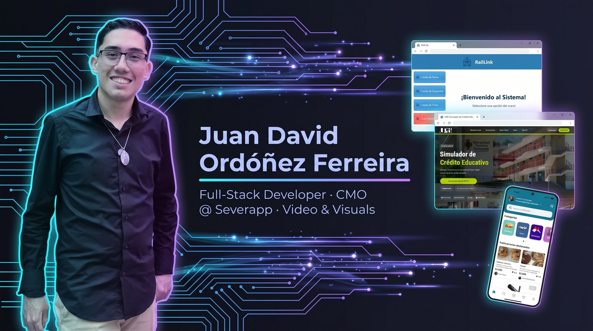
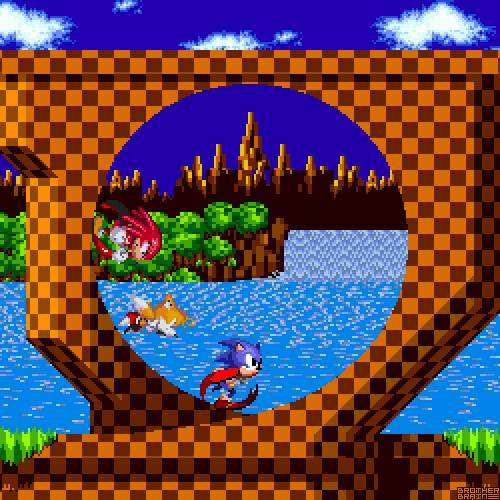

[🇪🇸 **Versión en Español**](README.md) &nbsp;·&nbsp; 🇺🇸 **English**

&nbsp;

&nbsp;

&nbsp;

&nbsp;

## 🚀 About Me

**Engineer in training, developer in practice, and creative by nature.**

I study **Systems Engineering & Computer Science** at **UPB** while working in the real
industry: enterprise and financial software by day, an award-winning startup in the
afternoons, and video editing whenever the code editor takes a break.

My personal thesis: *a good engineer understands the product as deeply as the code.*

 

<table>
<tr>
<td width="33%" valign="top" align="center">

<a href="https://github.com/tecnoinformaticaCO/">
<picture>
  <source media="(prefers-color-scheme: dark)" srcset="https://www.tecnoinformatica.co/images/logo2.png" />
  
</picture>
</a>

### 💼 Engineering

**Jr. Full-Stack @ [Tecnoinformática](https://github.com/tecnoinformaticaCO/)**

Enterprise & financial software house. I joined as an intern and earned a permanent spot on the team, building platforms for employee funds and cooperatives.

`Laravel` `Vue.js` `Scrum`
`CI/CD with GitHub Actions`

</td>
<td width="33%" valign="top" align="center">

 

 

### 📈 Product & Marketing

**CMO & Co-founder @ [Severapp](https://severapp.com)**

University marketplace — 🥇 **1st place at La Palanca (ApalancaFest)**, Bucaramanga Chamber of Commerce. I lead growth, partnerships and events — and also code on the app.

`Flutter` `Dart` `Firebase`
`Growth` `Partnerships` `Events`

</td>
<td width="33%" valign="top" align="center">

&nbsp;

### 🤝 Leadership & Creativity

**[Líderes UPB](https://www.upb.edu.co)** — holistic development program: soft skills, public speaking and university team management.

**Misiones UPB** — social-impact volunteering and community transformation: going out to meet others.

Plus my audiovisual side:

`Video editing` `CapCut`
`UX with Figma` `Community Mgmt`

</td>
</tr>
</table>

> 💳 **Current flagship project:** the [UPB Credit Simulator](https://github.com/Dabji/Simulador-Credito-UPB) — an educational credit simulator built with **Clean Architecture and a RESTful API** (React 19 + Node.js + TypeScript), designed to scale in the university's real environment and deployed with **Nginx, PM2 and RHEL** on CTIC infrastructure.

---

## 🛠️ Tech Stack

<table>
<tr>
<td align="right"><b>💻 Languages</b></td>
<td>
&nbsp;
&nbsp;
&nbsp;
&nbsp;
&nbsp;
&nbsp;

</td>
</tr>
<tr>
<td align="right"><b>🎨 Frontend</b></td>
<td>
&nbsp;
&nbsp;
&nbsp;
&nbsp;
&nbsp;
&nbsp;
&nbsp;
&nbsp;

</td>
</tr>
<tr>
<td align="right"><b>⚙️ Backend & APIs</b></td>
<td>
&nbsp;
&nbsp;
&nbsp;
&nbsp;
&nbsp;
&nbsp;
&nbsp;

</td>
</tr>
<tr>
<td align="right"><b>📱 Mobile</b></td>
<td>
&nbsp;
&nbsp;
&nbsp;

</td>
</tr>
<tr>
<td align="right"><b>🗄️ Databases</b></td>
<td>
&nbsp;
&nbsp;
&nbsp;
&nbsp;
&nbsp;
&nbsp;
&nbsp;
&nbsp;

</td>
</tr>
<tr>
<td align="right"><b>☁️ Cloud & DevOps</b></td>
<td>
&nbsp;
&nbsp;
&nbsp;
&nbsp;
&nbsp;
&nbsp;
&nbsp;
&nbsp;
&nbsp;
&nbsp;

</td>
</tr>
<tr>
<td align="right"><b>✅ Testing</b></td>
<td>
&nbsp;
&nbsp;
&nbsp;

</td>
</tr>
<tr>
<td align="right"><b>🧰 Tools & OS</b></td>
<td>
&nbsp;
&nbsp;
&nbsp;
&nbsp;
&nbsp;
&nbsp;
&nbsp;
&nbsp;
&nbsp;
&nbsp;

</td>
</tr>
<tr>
<td align="right"><b>🎬 Design & Video</b></td>
<td>
&nbsp;

</td>
</tr>
</table>

---

## 📊 Stats

<!-- Advanced metrics generated every 3 days by GitHub Actions (lowlighter/metrics) -->

  

---

## ⚡ Recent Activity

<!-- Auto-generated every 3 days by update-readme.yml — do not edit by hand -->
<!--START_SECTION:activity-->

| | 🔥 Latest moves | |
|:---:|:----------------------|:---:|
| ⭐ | Starred [`Dabji/Dabji`](https://github.com/Dabji/Dabji) | 🕓 *14 day(s) ago* |
| 🐛 | Opened issue [#305](https://github.com/Dabji/Simulador-Credito-UPB/issues/305) in [`Dabji/Simulador-Credito-UPB`](https://github.com/Dabji/Simulador-Credito-UPB) | 🕓 *16 day(s) ago* |
| ⭐ | Starred [`Dabji/Simulador-Credito-UPB`](https://github.com/Dabji/Simulador-Credito-UPB) | 🕓 *16 day(s) ago* |
| 🌍 | Made public [`Dabji/Simulador-Credito-UPB`](https://github.com/Dabji/Simulador-Credito-UPB) | 🕓 *4 month(s) ago* |
| ⭐ | Starred [`Dabji/Turismo-Cali-UPB`](https://github.com/Dabji/Turismo-Cali-UPB) | 🕓 *25 day(s) ago* |
| 🌍 | Made public [`Dabji/Turismo-Cali-UPB`](https://github.com/Dabji/Turismo-Cali-UPB) | 🕓 *4 month(s) ago* |
| ⭐ | Starred [`Dabji/Hegemony-Linear`](https://github.com/Dabji/Hegemony-Linear) | 🕓 *26 day(s) ago* |
| 📦 | Published release [v1.0.0](https://github.com/Dabji/Hegemony-Linear/releases/tag/v1.0.0) in [`Dabji/Hegemony-Linear`](https://github.com/Dabji/Hegemony-Linear) | 🕓 *26 day(s) ago* |

<!--END_SECTION:activity-->

---

## 📌 Featured Projects

<!-- Auto-generated every 3 days by update-readme.yml — do not edit by hand -->
<!--START_SECTION:projects-->

🔄 Automatically updated every 3 days

<table>
<tr>
<td align="center" width="50%">

</td>
<td align="center" width="50%">

</td>
</tr>
<tr>
<td align="center" width="50%">

</td>
<td align="center" width="50%">

</td>
</tr>
<tr>
<td align="center" width="50%">

</td>
<td align="center" width="50%">

</td>
</tr>
</table>

<!--END_SECTION:projects-->

---

## 🦔 Contributions

💍 Every golden ring is a contribution. Gotta go fast.

<picture>
  <source media="(prefers-color-scheme: dark)" srcset="https://raw.githubusercontent.com/Dabji/Dabji/output/sonic-dark.svg" />
  <source media="(prefers-color-scheme: light)" srcset="https://raw.githubusercontent.com/Dabji/Dabji/output/sonic-light.svg" />
  
</picture>

---

## 📫 Let's Connect

&nbsp;&nbsp;

&nbsp;&nbsp;

&nbsp;&nbsp;

&nbsp;&nbsp;

<table>
<tr>
<td align="center" width="12%"></td>
<td align="center" width="76%">

## *“A good engineer doesn't just write code: they understand the product, communicate well, and know how to show their value.”*

**— Juan David Ordóñez Ferreira**

</td>
<td align="center" width="12%"></td>
</tr>
</table>

